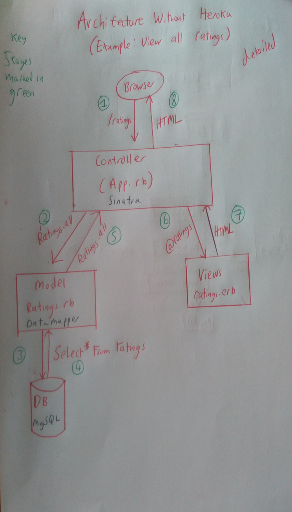

<h2 align="center"> FT Feedback Site </h2>
<h3 align="center"> Have a look at the new reviews site for the FT <a href='https://shrouded-mesa-54307.herokuapp.com/ratings/new'>here</a> </h3>

 <p align="center">  <a href='#scenario'>Scenario</a> |  <a href='#approach'>Approach</a>   |   <a href='#reflections'>Reflections</a> |   <a href='#versions'>Versions</a> |  <a href='#use'>How to use</a>   |   <a href='#tech'>Tech</a> | <a href='#architecture'>Architecture</a>


## Scenario  <a name= "scenario"></a>

Build a website hosted in the cloud (e.g. AWS, Google, Heroku) that asks for and stores a simple
rating score for using ft.com

Provide a diagram of your site architecture showing key compnents that illustrate your approach.

*Extra*
 - Templated infrastructure as code  
 - Automated testing
 - Origami Compnents/FT look and feel
 - The ability to view the ratings/results

## Approach <a name= "approach"> </a>

#### Design
My focus is to break down the task into lots of smaller steps - to this I created versions, <a href='#version'>see below</a>, at the start of the project to act as checkpoints. My reasonsing for this, was rather than design everything in one go and then go off and code, I had clear points to stop, reflect and adapt my plans. Also by focusing on reaching the smaller targets, I keep my programme simpler to start with and if I turn out to do something badly, its easier to turn back and change.

This approach to design is something I am trialing so any feedback would be really helpful. In my commits I've tried to add explanations for the order of my decisions.

#### Tech
I decided to do the task in Ruby, as this website is quite light and I felt that doing it with Sinatra and Datamapper nice and simple tools for the job. My original plan was to use AWS, but I set a fixed period of time to achieve this as I knew it could be tricky. In the end I deployed with Heroku, but you can read my  <a href= "#reflections"> reflections</a> to see what I learnt and my reasoning to go to Heroku.

#### Targets (Written before starting) - no more than 4 points
- Only focus on reaching a checkpoint, don't worry about the extra complexity until you get there.
- Try to use AWS to deploy the website
- Keep it as simple as possible
- Reflect on my architecture and design frequently (especially at designated checkpoints) to check if there is any way of improving it further.

## Reflection <a name= "reflections"> </a>
I've been pleased with keeping the programme simple and leaving it extendable in the future. In terms of design, I found gradual increase rather than planning it all first worked well.

Part of me thinks I should have gone with a JSON file or another file to store ratings, rather than a full MySQL database. However, I decided to stick with it, since I wanted to show I could integrate a website with a database on a cloud platform. But probably doing this again, I'd try just using something lighter to see how well this works.

Deployment has been my greatest challenge. I timeboxed a period to see if I could succeed in deploying to AWS. I've learnt alot about deployment, but I ended up pausing it as it was taking too long to achieve. This is something I want to explore more. One thing I would like to do is deploy a practise site with no database first, and then practise hooking up a database. But I was glad I moved in small steps, as I only had to make not too many changes to change to deploying with heroku. 

#### With more time I would have:
  - Built a sandbox project, deployed it to AWS and then deployed this site to AWS too (something
    I will be exploring further)
  - Integrated CI (I started to do this Travis, but there were issues with mySQL and it. So
    as it was extra I left it for if I had time.)
  - Added comments to the feedback
  - Read more about infrastructure as code

## Versions <a name= "versions"> </a>

V1: You are asked for a rating on a locally hosted website and it stores the ratings  
  - [x] You can visit a site
  - [x] You can submit a rating or any sort
  - [x] You can store the rating in a database
  - [x] Make it a single page site
  - [x] You can only add ratings of 1 - 5

V2: You are asked for a rating on a hosted website  (MVP)
  - [x] Deploy up the site on Heroku

V3: You can see previous (all ratings) on another page, previous ratings
  - [x] Second page with all previous ratings shown

V4: (Extras) Make it stylish, to look like the FT
  - [x] Add Origimi style
  - [x] Draw diagram of architecture of site
  - [x] Write reflections and tidy up readme
  - [x] Align everything in the site well
  - [x] Make the submit button look nicer and link to the next page
  - [x] Sort out the reviews page
  - [x] Upload diagrams

## How to use  <a name= "use"> </a>
First make sure you have Ruby 2.4.0+ and MySQL installed

#### Database setup
Then set up a Dev and Test database in the MySQL bash

```CREATE DATABASE ft_test;```
```CREATE DATABASE ft_development;```

I've called the user ft@localhost, you can either give this permissions to these two databases, or change the user in the models/ratings.rb file. Either way in my MySQL base:
```
GRANT ALL PRIVILEGES ON ft_test.* TO 'ft'@'localhost;'
GRANT ALL PRIVILEGES ON ft_development.* TO 'ft'@'localhost;' ```
```
#### Run site

1) Copy the repo ```git clone https://github.com/Tagrand/makers-cloud-engineering-exercise.git```
2) Go into the repo ```cd makers-cloud-engineering-exercise```
3) Install gems ```bundle```
4) Run the server ```rackup```
5) Visit [localhost:9292](localhost:9292) to see it all in glory!  

## Tech <a name= "tech"> </a>
Ruby
Sinatra   
MySQL
Heroku
Datamapper

## Architecture <a name= "architecture"> </a>
#### A few diagrams of the site structure (apologies for my handwriting!)



